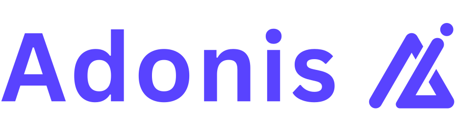

<p align="center">
  
</p>

<div align="center">

[![Tests][tests-image]][tests-url] [![npm][npm-image]][npm-url] ![TypeScript][typescript-image] [![License][license-image]][license-url]

</div>

A Laravel-inspired, agent-oriented AI SDK for AdonisJS 7.

`adonis-ai` gives Adonis applications one typed API for AI SDK-compatible language models. Use OpenAI and Anthropic directly, reach every model available through Vercel AI Gateway, or register any official, community, self-hosted, registry-backed, or middleware-wrapped AI SDK language model. The first release focuses on the parts needed to build dependable text agents: streaming, structured output, application tools, observability, cancellation, and network-free tests.

> Status: `0.1.0-alpha.0`. The public API is usable, but may change before `0.1.0`.

## Compatibility

| Dependency    | Supported version                                |
| ------------- | ------------------------------------------------ |
| AdonisJS      | `^7.0.0`                                         |
| Node.js       | `>=24.0.0`                                       |
| Zod           | `^4.0.0`                                         |
| Vercel AI SDK | Core, AI Gateway, and compatible language models |
| OpenAI        | Responses API via `@ai-sdk/openai`               |
| Anthropic     | Messages API via `@ai-sdk/anthropic`             |

## What is included

- Reusable `BaseAgent` classes and an `agent({...})` factory
- Vercel AI Gateway access to its full language-model catalog
- A public shared adapter for any AI SDK-compatible language model
- Built-in direct OpenAI Responses and Anthropic Messages drivers
- Async-iterable streaming with SSE conversion
- Zod 4 structured output with provider-native JSON Schema
- Zod-validated application tools and a shared multi-step tool loop
- Normalized responses, token usage, steps, request IDs, and errors
- Abort and timeout propagation, including SSE disconnect cancellation
- Adonis IoC singleton, typed events, configure hook, and Ace generators
- Queued or dynamic fakes with prompt assertions and stray-call prevention
- A real AdonisJS playground with functional and browser tests

The current Adonis agent surface covers text generation, streaming, structured output, application tools, provider options, retries, timeouts, cancellation, and middleware-wrapped language models. Multimodal messages, provider-executed tools, embeddings, image/video generation, speech, transcription, reranking, realtime, stored conversations, queues, approvals, MCP, and vector stores need dedicated public APIs and remain deferred.

## Repository layout

```text
packages/adonis-ai   Publishable SDK package
apps/playground      AdonisJS 7 consumer app and package lab
```

## Quick start

```bash
npm install adonis-ai zod
node ace configure adonis-ai
```

Set at least one provider and model in `.env`.

```dotenv
AI_DEFAULT_PROVIDER=openai
OPENAI_API_KEY=
OPENAI_MODEL=

ANTHROPIC_API_KEY=
ANTHROPIC_MODEL=

AI_GATEWAY_API_KEY=
AI_GATEWAY_MODEL=openai/gpt-5
```

Create an agent.

```bash
node ace make:ai-agent Support
```

```ts
import { BaseAgent } from "adonis-ai";

export default class SupportAgent extends BaseAgent {
  instructions() {
    return "Answer product questions clearly and concisely.";
  }
}
```

Use direct construction for dependency-free agents, or `ai.make` when the Adonis container should construct the class.

```ts
import SupportAgent from "#ai/agents/support_agent";
import ai from "adonis-ai/services/main";

const agent = await ai.make(SupportAgent);
const response = await agent.prompt("How do I reset my password?");

console.log(response.text);
console.log(response.usage);
console.log(response.steps);
```

## Streaming

Every stream is an async iterable and can also be sent directly from an Adonis controller.

```ts
const stream = agent.stream("Explain server-sent events");

for await (const event of stream) {
  if (event.type === "text.delta") {
    process.stdout.write(event.delta);
  }
}

const final = await stream.finalResponse();
```

```ts
async stream({ response }: HttpContext) {
  const stream = agent.stream('Explain server-sent events')
  response.header('Content-Type', 'text/event-stream')
  return response.stream(stream.toSseReadable())
}
```

Normalized events are:

- `run.started`
- `text.delta`
- `tool.started`
- `tool.completed`
- `step.completed`
- `run.completed`
- `run.failed`

Destroying the readable SSE stream aborts the upstream provider request.

## Structured output

```ts
import { BaseAgent } from "adonis-ai";
import { z } from "zod";

const output = z.object({
  summary: z.string(),
  risks: z.array(z.string()),
});

class ReviewAgent extends BaseAgent<typeof output> {
  readonly outputSchema = output;

  instructions() {
    return "Review the input and identify its risks.";
  }
}

const response = await new ReviewAgent().prompt("Review this proposal");
response.data.summary; // string
response.data.risks; // string[]
```

The adapter asks the provider to enforce JSON Schema, then the shared engine parses and validates the completed value with Zod. During structured streaming, text deltas remain partial strings and typed data is exposed only on the final response.

## Application tools

```ts
import { defineTool } from "adonis-ai";
import { z } from "zod";

const weather = defineTool({
  name: "weather",
  description: "Get the weather for a city",
  input: z.object({ city: z.string() }),
  async execute({ city }, { signal }) {
    return getWeather(city, { signal });
  },
});
```

Return tools from an agent’s `tools()` method. Multiple tool requests are executed sequentially in provider order. The default maximum is eight model steps. Input and handler errors are sent back to the model as safe tool results; pass `{ toolErrorMode: 'throw' }` to stop immediately.

## Testing

```ts
import ai from "adonis-ai/services/main";

const fake = ai
  .fake([
    "First answer",
    { data: { summary: "Typed fake", risks: [] } },
    { text: "Streamed", chunks: ["Stream", "ed"] },
  ])
  .preventStrayRequests();

await agent.prompt("Question");
fake.assertPrompted("Question");
```

Dynamic fakes receive both the recorded prompt and normalized provider request, so tests can model tool loops without network access.

## Local development

Requires Node.js 24 and npm 11.

```bash
npm install
npm run check
npm run dev --workspace playground
```

The playground resolves `adonis-ai` directly from the local workspace. To verify the exact
artifact that npm consumers receive, run the isolated package-consumer check:

```bash
npm run test:package-consumer
```

This packs the SDK, installs the tarball into a temporary standalone copy of the playground,
and runs its typecheck, tests, and production build.

The default suite never calls a real AI API. Live acceptance is opt-in and cost-bounded:

```bash
AI_LIVE_PROVIDER=openai npm run test:live:openai --workspace adonis-ai
AI_LIVE_PROVIDER=anthropic npm run test:live:anthropic --workspace adonis-ai
AI_LIVE_PROVIDER=gateway npm run test:live:gateway --workspace adonis-ai
```

## Provider extensions

The built-in `gateway` driver uses `creator/model` IDs and reaches every language model available in Vercel AI Gateway with one API key:

```ts
export default defineConfig({
  default: "gateway",
  providers: {
    gateway: {
      driver: "gateway",
      apiKey: env.get("AI_GATEWAY_API_KEY"),
      model: "anthropic/claude-sonnet-4",
    },
  },
});
```

Gateway routing, fallback, attribution, and provider-specific settings pass through `providerOptions`:

```ts
await agent.prompt("Explain the tradeoff", {
  providerOptions: {
    gateway: {
      order: ["vertex", "anthropic"],
      models: ["openai/gpt-5-mini"],
      tags: ["support"],
    },
    anthropic: {
      thinking: { type: "enabled", budgetTokens: 4_000 },
    },
  },
});
```

To use a provider package directly, install only that package and register its language model with the public adapter:

```ts
import { google } from "@ai-sdk/google";
import { AiSdkProvider } from "adonis-ai/providers/ai-sdk";

ai.extend("google", (_config, context) => {
  return new AiSdkProvider({
    name: context.name,
    providerOptionsKey: "google",
    model: (modelId) => google(modelId),
  });
});
```

This same entrypoint accepts AI SDK provider registries, community and self-hosted providers, custom providers, and models wrapped with AI SDK middleware. For a non-AI-SDK integration, implement `ProviderAdapter` directly:

```ts
ai.extend("community-driver", (config, context) => {
  return new CommunityProvider(config, context.name);
});
```

The Vercel AI SDK provider layer translates model requests, responses, errors, usage, and streaming events. Agent composition and the multi-step application tool loop remain in Adonis AI, preserving the existing public API and extension contract. Individual providers and models still differ in capability; Adonis AI forwards supported features and normalizes their results rather than emulating capabilities a model does not have.

## Security defaults

- OpenAI response storage defaults to `false`
- Prompts are excluded from emitted events unless explicitly enabled
- Raw provider payloads are opt-in and typed as `unknown`
- Default timeout is 60 seconds with two SDK-level retries
- API keys are never included in normalized events or errors

## Support

- Ask usage and design questions in [GitHub Discussions](https://github.com/nir-jas/adonis-ai/discussions).
- Report reproducible bugs and request features through [GitHub Issues](https://github.com/nir-jas/adonis-ai/issues).
- Report vulnerabilities privately through [GitHub Security Advisories](https://github.com/nir-jas/adonis-ai/security/advisories/new).
- See [SUPPORT.md](./SUPPORT.md), [SECURITY.md](./SECURITY.md), and [CONTRIBUTING.md](./CONTRIBUTING.md) for project policies.

## Acknowledgements

The developer experience is inspired by [Laravel AI](https://laravel.com/docs/13.x/ai-sdk), while the implementation follows AdonisJS and TypeScript conventions and uses [Vercel AI SDK Core](https://ai-sdk.dev/docs/ai-sdk-core/overview). OpenAI uses its [Responses API](https://developers.openai.com/api/docs/guides/migrate-to-responses); Anthropic uses its [Messages API](https://platform.claude.com/docs/en/api/messages).

MIT licensed.

[tests-image]: https://img.shields.io/github/actions/workflow/status/nir-jas/adonis-ai/ci.yml?branch=main&label=Tests&style=for-the-badge&colorA=15122e&colorB=8b7cff&logo=githubactions&logoColor=white
[tests-url]: https://github.com/nir-jas/adonis-ai/actions/workflows/ci.yml
[npm-image]: https://img.shields.io/npm/v/adonis-ai/latest.svg?style=for-the-badge&colorA=15122e&colorB=ff5a4f&logo=npm&logoColor=white
[npm-url]: https://www.npmjs.com/package/adonis-ai/v/latest
[typescript-image]: https://img.shields.io/badge/TypeScript-3178c6.svg?style=for-the-badge&labelColor=15122e&logo=typescript&logoColor=white
[license-image]: https://img.shields.io/github/license/nir-jas/adonis-ai?style=for-the-badge&colorA=15122e&colorB=43d9c2
[license-url]: ./LICENSE.md
